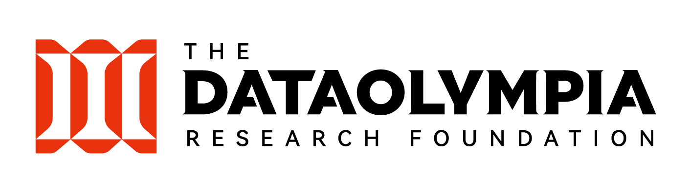

# Welcome

**The DataOlympia Research Foundation** is a non-profit organization that
provides grants to researches in the data industry.

## Domains

We support grants in the following domains in the data industry:

- data storage system
- database system
- data warehouse, data lake, data lakehouse
- data ingestion, batch and stream processing
- data analysis, information retrieval
- machine learning, artificial intelligence

## Activities

We support grants for activities such as:

- working on open source projects
- conducting domain specific surveys
- developing new industry benchmarks

## Contact

For requesting grants or asking more questions, please email [info@dataolympia.com](mailto:info@dataolympia.com)